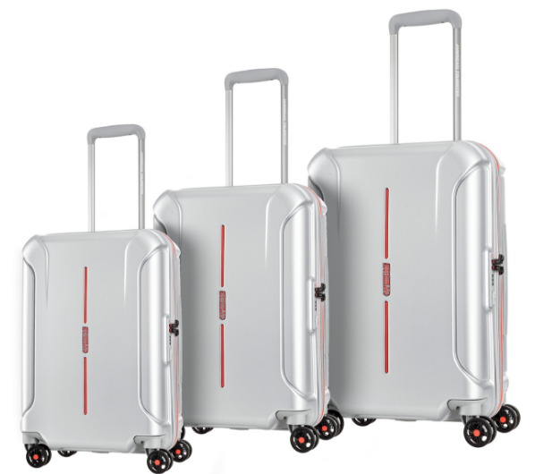
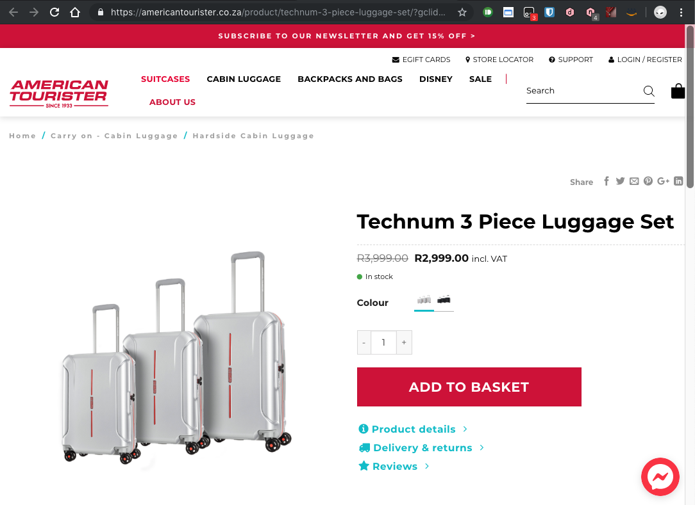
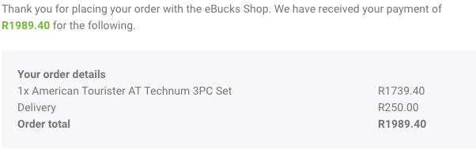

## Every trip needs a suitcase

...and this could be expensive. I was however lucky to snag the pictured ones at a great price using a rewards system without using actual money.

On the [official website](https://americantourister.co.za/product/technum-3-piece-luggage-set/), these are usually priced at R3999 and on special for R2999 at the time.

I was able to get them for a total of R1989.40 from the eBucks shop on the [FNB App](https://play.google.com/store/apps/details?id=za.co.fnb.connect.itt).

An absolute steal for a set that gets good [reviews](https://www.ebags.com/product/american-tourister/technum-3pc-hardside-expandable-spinner-luggage-set/362115#ratings-and-reviews).

We used them on a short trip to Pretoria a week ago, only the smaller two of the three. They pretty much work as expected and knowing they go through some punishment on these flights, they surived the trip with nothing breaking on them.

Will definitely recommend these to all travelers.
