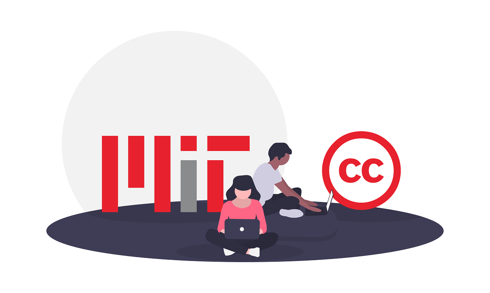
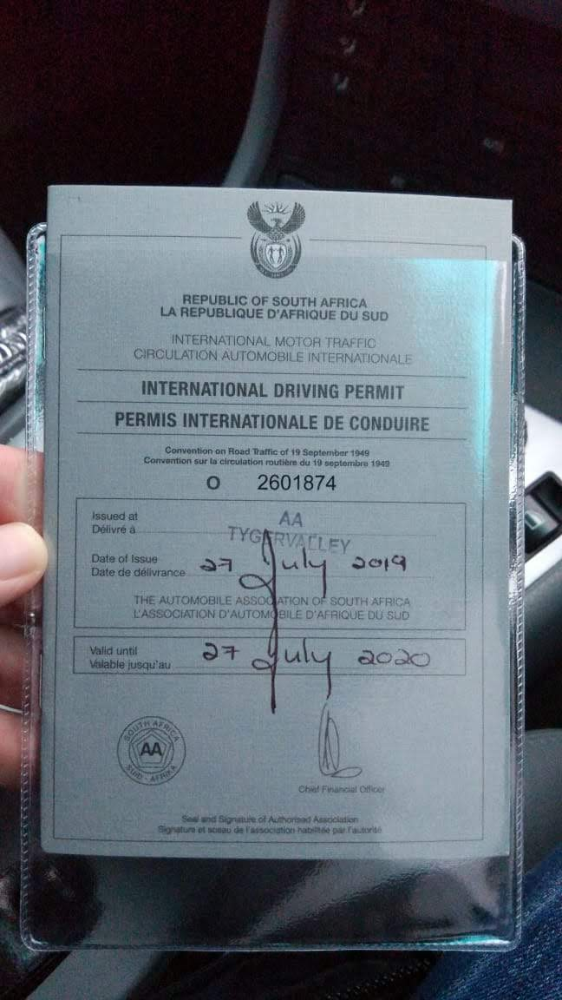
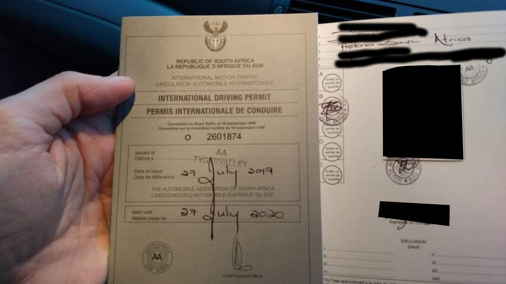

## International Drivers Permit

### Because why not?

And I really mean it. It only took 10 minutes at [Club Travel] in Tygervalley mall which is 5 minutes drive from our house. 

Technically for South Africans to be allowed to drive legally in the UK, you only need your South African drivers license, however the small print for any insurrance be it a hired vehicle or anyone elses vehicle state, that if you do not have an IDP that was issued before the accident, they will not pay out any cover.

So I went out to get one, just in case I do need it.

Front:

Inside:

[Club Travel]: https://www.google.com/maps/place/Club+Travel/@-33.8739,18.6325253,17z/data=!3m1!4b1!4m5!3m4!1s0x1dcc50b0a9f27947:0x7b9456a4dd638a4c!8m2!3d-33.8739!4d18.634714