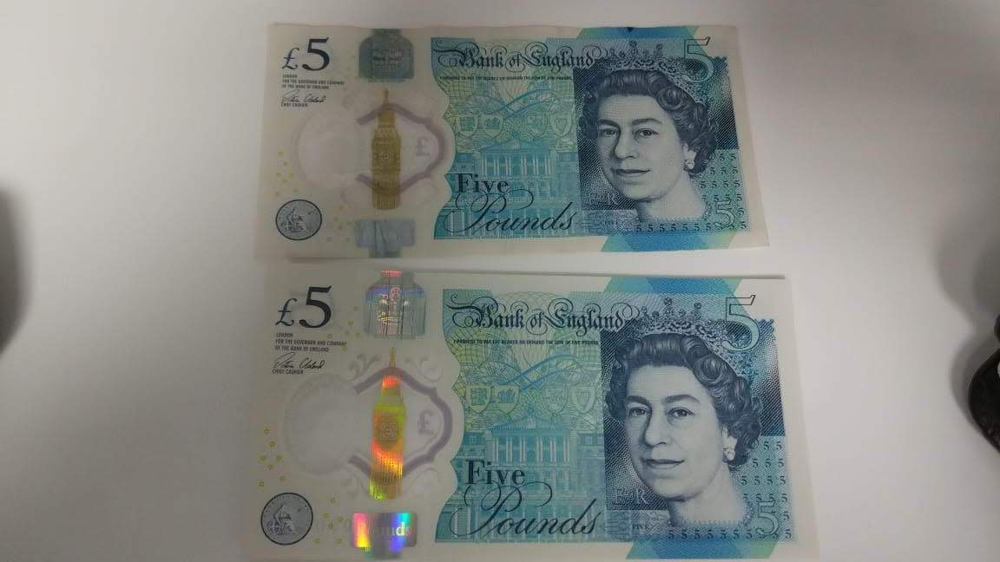
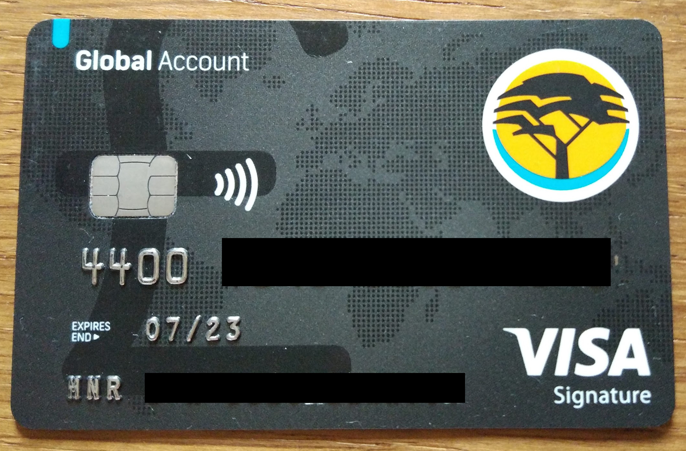

## Picked up two 5 pound notes from FNB

Quick update. 

It is 1 day before flying.

Ordered two 5 pound notes from FNB using online banking. The website allows you then to upload all the required documents which then allow you to rock up at the branch and just collect the notes after signing a document. Do make sure you plan this up front, because you can't order more in the branch without the documents again.

Was a relatively smooth process, except in Cape Town I was limited to either Stellenbosch, Somerset West or Foreshore branches.

This was only for anything small needed before we could get to an ATM, because I already loaded most of the budget on to a FNB Global pound card.

