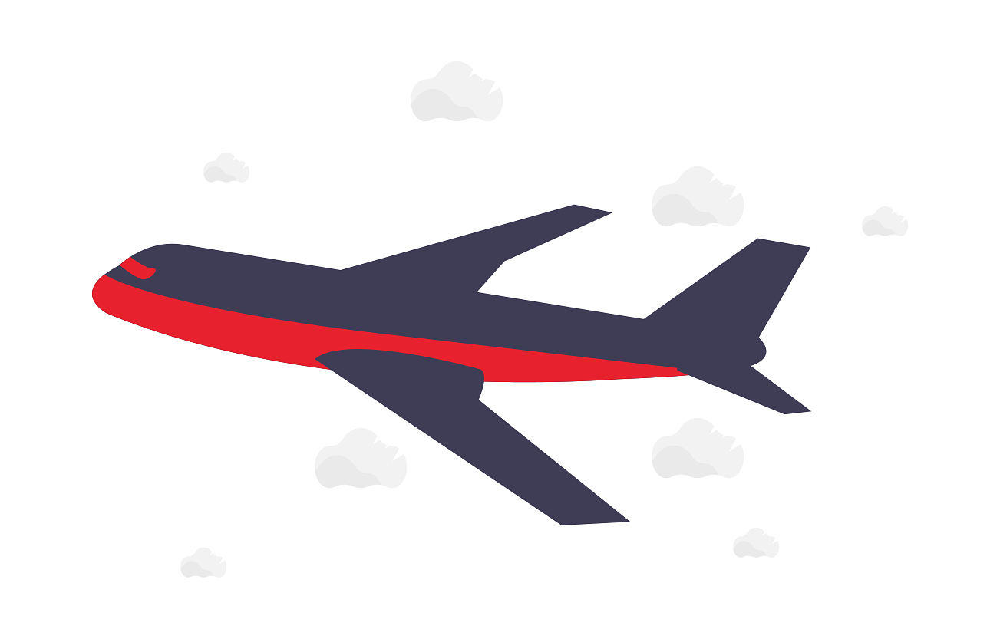

## Take off

So, the day to leave for our holiday had finally arrived. It was supposed to run smoothly - we'd finished packing the day before and all was prepared...

...but on the morning, father-in-law decided he doesn't want to go anymore. After tossing and turning all night, he admitted to himself that it's probably best for him not to travel the long distance to the UK. Just before we went to pick him up, we gave him a call to make sure he was ready, which is when he informed us of his decision!

There were still a few items that we'd set aside to go into his suitcase - now to have the weight evenly distributed, we needed to re-arrange things right before leaving for the airport. This led to some last-minute panicked clock-watching, and meant we didn't really take any photos before flying.

I also had to take care of the unexpected booking change, because I'd checked-in all 4 travelers the previous day and now had to remove one. Emirates let us know we also needed to inform the travel agent, which in this case was Woolworths VIP Rewards. I sent an email after we checked-in and were waiting to board the plane. I was informed we'd get a refund but that there'd be a fee to process it. Under the circumstances, a processing fee was completely understandable, so I said I'm happy with that and gave them the go-ahead.

Once we boarded the plane, we finally had time for some pictures:

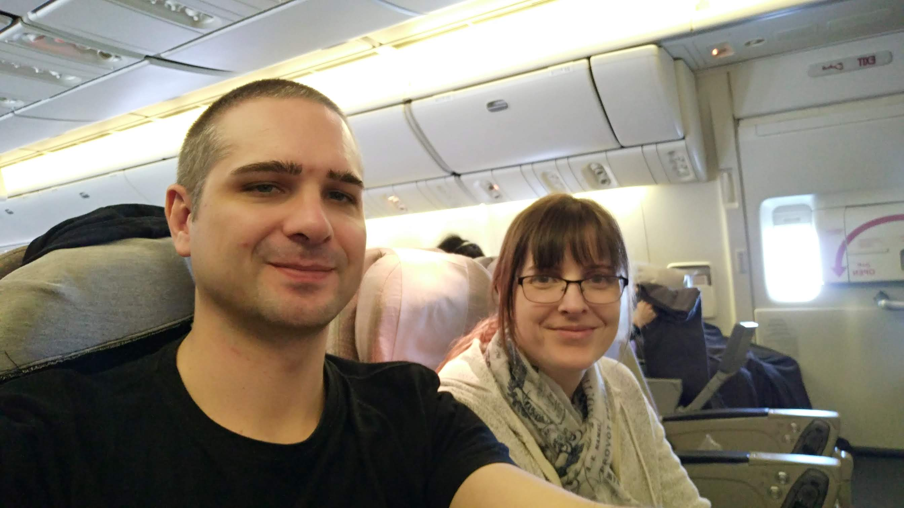

The little one was on our lap for take-off, but received a basinette for the rest of the flight. She made herself at home pretty quickly whilst playing with her free Emirates toy:

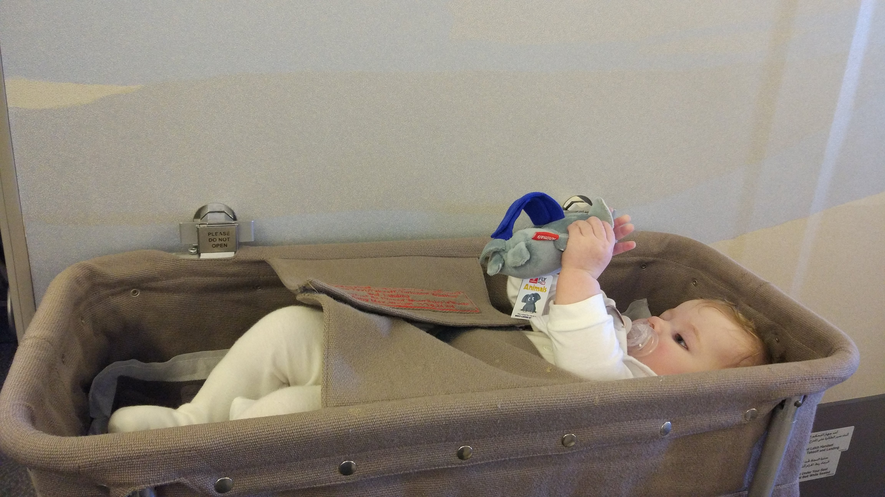

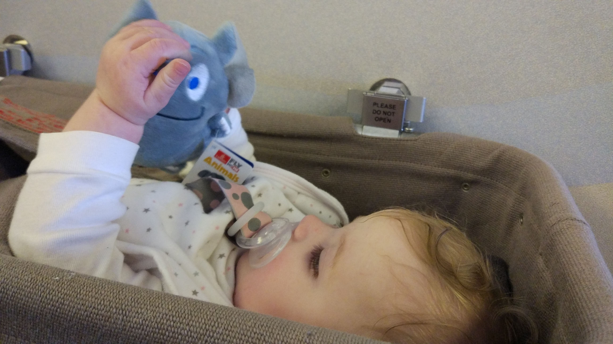

And then fast asleep!

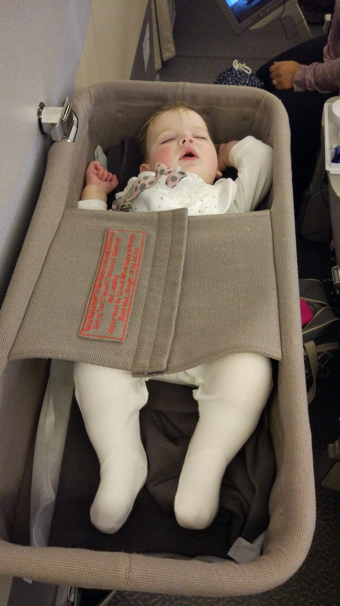

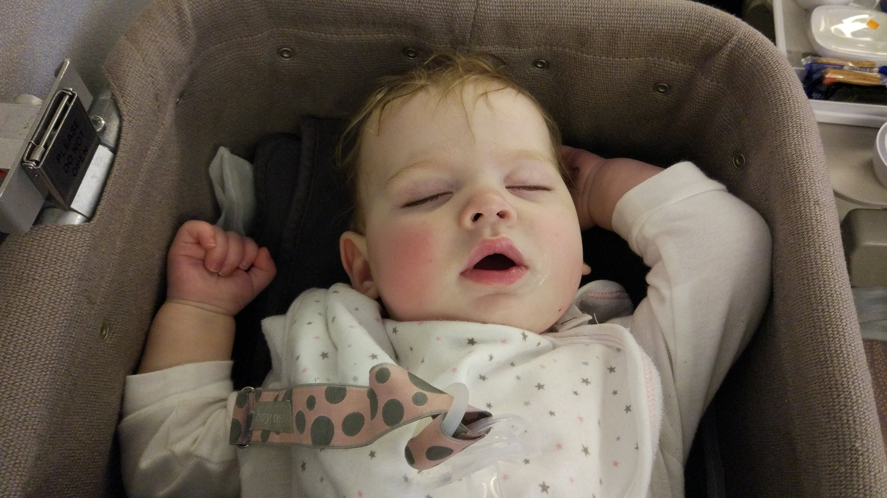

9 hours later we were waiting in Dubai (UAE) for our connecting flight to Manchester. Experiencing 38C at 01:00 certainly reminded us that we were leaving our winter weather behind:

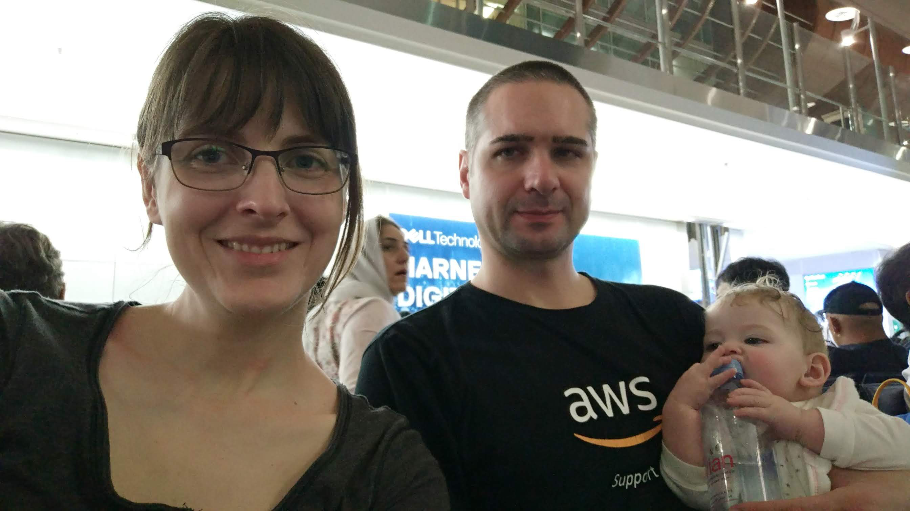

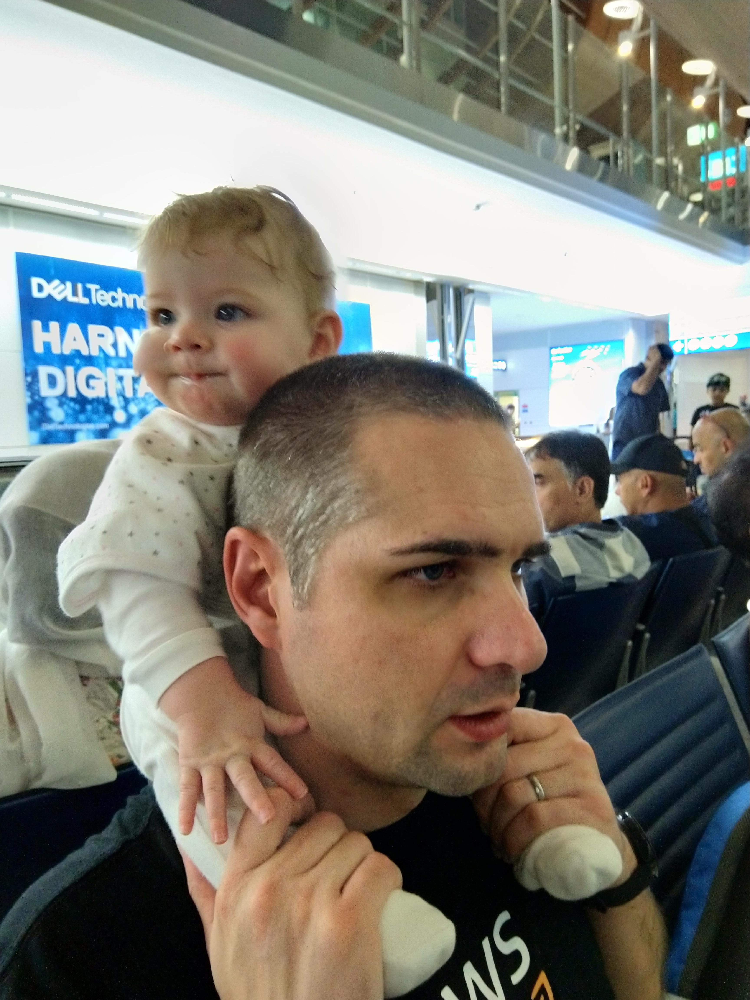

After another almost 8 hours in the air, we finally arrived at our destination. Despite having a cold and mild infections in both ears, the little one was an absolute star during both flights and landings - and was full of smiles while we collected our luggage:

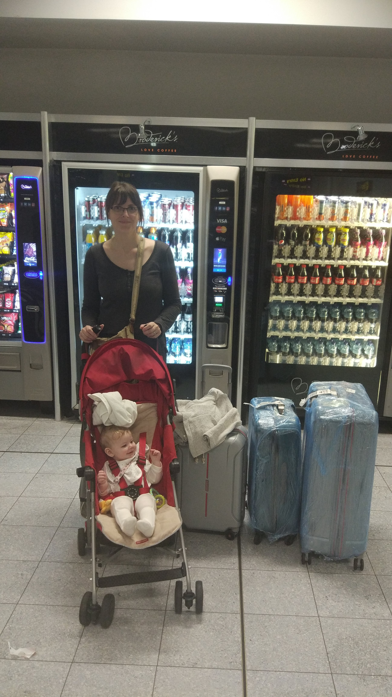

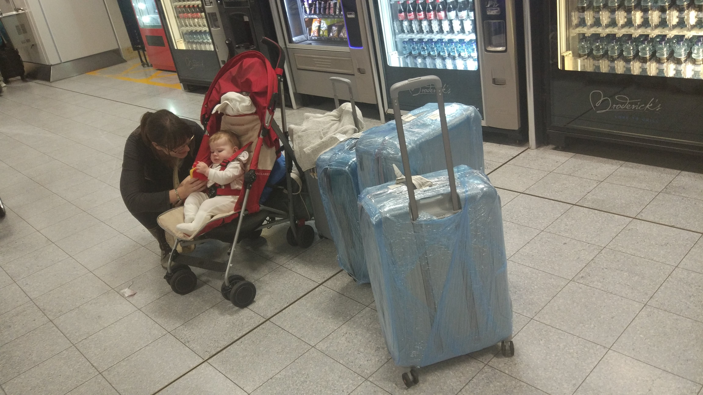

Confession time: while we were being chauffeured from the airport, I fell asleep in the car; neither my wife nor I had managed more than a single quick snooze during the flights. Once we arrived at the house, though, I took a sneaky photo just after we sat down:

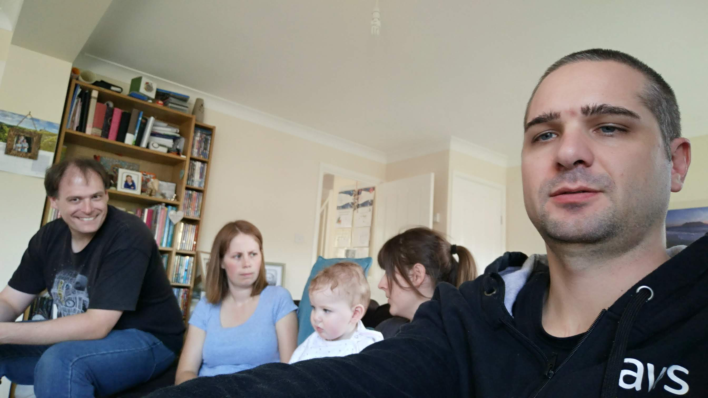

Our soon-to-be sister-in-law, Sam, couldn't wait to meet (and feed!) Amy, with Rose looking on.

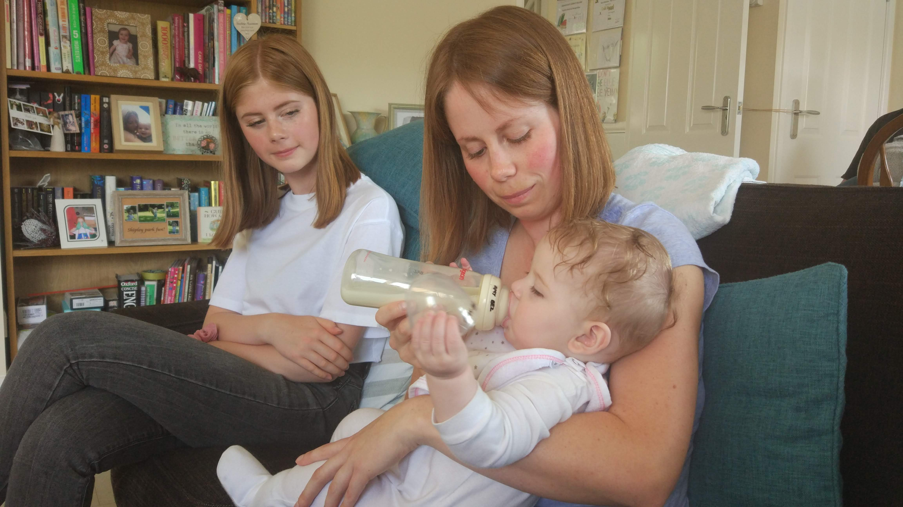

