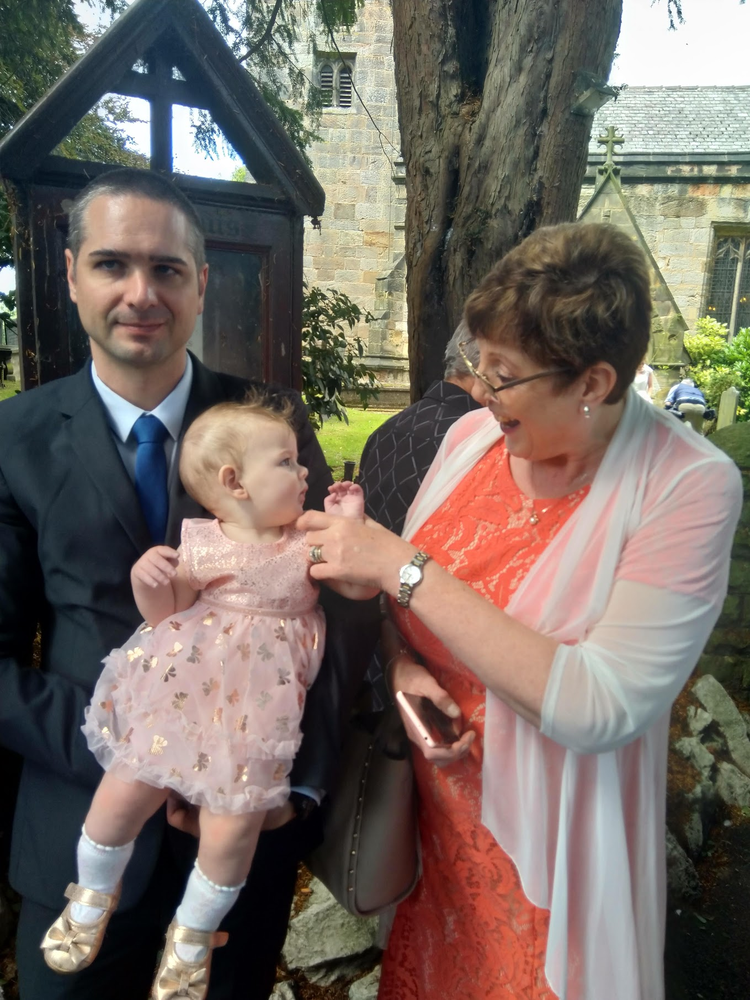

## Wedding day

Of course, the main reason for our visit to the UK was to attend Sam and David's wedding. 

Wedding days are certainly right up there as one of the most special days for any couple, despite all the last-minute issues which always seem to pop up in even the most organised plans! There were a few of those the day before this wedding, too, but everything turned out perfectly in the end. It was truly wonderful to be able to share this special day with the two of them.

This is a message in Pam's handwriting, which Sam embroidered for David:

Signing the register:

While waiting outside for the couple, Auntie Stephanie meets Amy:

Outside the church:

Sam poses for a photo:

Erm.

I mean, Sam poses for a photo:

Last photo before leaving for the reception:

The new Mr and Mrs Smith visit the table at which Karen and I were sitting, and Amy is very interested in Sam:

Sam and Amy have a toy-bonding moment:

And then a jewellery-bonding moment:

I have a conversation with Lindsey:

Mr and Mrs Smith open the dance floor with a wonderful dance:

Late in the evening, Amy fell asleep:

This allowed us to get some dancing in:

<iframe width="560" height="315" src="https://www.youtube.com/embed/Kkvjt6L6gJI" frameborder="0" allow="accelerometer; autoplay; encrypted-media; gyroscope; picture-in-picture" allowfullscreen></iframe>

